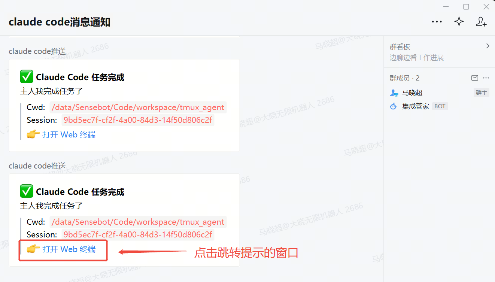

# tmux-agent

浏览器里使用 tmux：户外用手机 / 笔记本通过 VPN 访问家里主机的 tmux session。每个 tile 是一个 tmux window，点开就是一个全屏 xterm，配套固定按钮、文本输入、文件上传（拖拽 / 粘贴板）。



https://github.com/user-attachments/assets/7fde04cc-bc3e-4c04-8208-03ca8ca537e0

## Quickstart（3 分钟跑起来）

需要：**Node ≥ 18 + tmux**（`apt install tmux` 或 `brew install tmux`）。

```bash
git clone https://github.com/chaochaoxiaochao/tmux_agent.git tmux-agent
cd tmux-agent
tmux new -d -s claude              # 准备一个目标 session（已有就跳）
./scripts/install-systemd.sh       # 装依赖 + 编译 + 注册为 user systemd 服务
```

打开 `http://127.0.0.1:7681` —— 就这样。

> 装完即在跑，重启机器也会自起。同网段 / VPN 设备把 `127.0.0.1` 换成主机 IP 即可。

只想跑一次（不装服务）？

```bash
npm install && npm run build
tmux new -d -s claude
npm start
```

## 常见操作

```bash
systemctl --user restart tmux-agent      # 改代码后 npm run build && 这条
systemctl --user status  tmux-agent
journalctl --user -u tmux-agent -f       # 看日志
```

让服务在你 SSH 登出后也活着（手机半夜也能连）：

```bash
loginctl enable-linger $USER             # 一次性
```

## Wall 视图颜色

- 🟢 **绿** — 该 pane 最近 5 秒有输出
- ⚪ **灰** — 静止
- 🟡 **黄脉动 + INPUT badge** — 外部 hook 触发的"等输入"提醒
- 🔵 **蓝脉动 + DONE badge** — 外部 hook 触发的"任务完成"提醒

进入对应 attached view 自动清掉脉动状态。

## 配置（可选）

第一次启动会自动写 `~/.config/tmux-agent/config.yaml`。常用调整：

```yaml
server:
  host: 0.0.0.0          # 想锁本机：127.0.0.1
  port: 7681
  publicUrl: http://<host-ip>:7681   # 给 hook 通知拼 deep link 用
```

完整字段（statusRules / buttons / log）见 `server/src/config.schema.ts`。

## Claude Code Hook 集成（可选）

让 Claude Code 弹"等输入"或"任务完成"时：

1. 对应 wall tile 黄/蓝闪烁（进 attached view 自动清）
2. 推一条企微消息，带「打开 Web 终端」可点链接

原理：3 类 hook event 调用同一个 bash 脚本，脚本根据 event + tool_name 分别推送不同文案 —— 同时 POST `/api/notify` 给 tmux-agent + POST 企微 webhook。

| Event | matcher | 何时触发 | 微信文案 |
|---|---|---|---|
| `Stop` | `""` (全匹配) | 每个 turn 结束 | ✅ 主人我完成任务了 |
| `PermissionRequest` | `.*` | Claude 主动问问题(`AskUserQuestion`) **或** Edit/Bash 等工具权限审批弹窗 | ❓ 主人我需要问你 / 🔐 主人我需要你批准 X 操作（按 `tool_name` 分） |
| `Notification` | `permission_prompt` | 内置工具 notification（实际很少触发，备用） | 🔔 等输入 |

⚠️ **不要**再单独加 `PreToolUse + AskUserQuestion` —— `PermissionRequest` 已经覆盖 `AskUserQuestion`，再加会**同一次 ask 收两条微信**（去重坑）。

**步骤**

1. config.yaml 加 `server.publicUrl: http://<your-host-ip>:7681`（VPN 网卡 IP / 内网 IP），改完 `systemctl --user restart tmux-agent`
2. `~/.claude/settings.json` 注册 hook：

```json
{
  "hooks": {
    "Stop": [
      {
        "matcher": "",
        "hooks": [
          { "type": "command", "command": "bash ~/.claude/hooks/notify_wechat.sh" }
        ]
      }
    ],
    "PermissionRequest": [
      {
        "matcher": ".*",
        "hooks": [
          { "type": "command", "command": "bash ~/.claude/hooks/notify_wechat.sh" },
          { "type": "command", "command": "printf '\\a'" }
        ]
      }
    ],
    "Notification": [
      {
        "matcher": "permission_prompt",
        "hooks": [
          { "type": "command", "command": "bash ~/.claude/hooks/notify_wechat.sh" },
          { "type": "command", "command": "printf '\\a'" }
        ]
      }
    ]
  }
}
```

注意:
- `PermissionRequest` 才是 Claude Code **实际处理"需要用户决定"**(AskUserQuestion + 工具权限审批)的事件,**不要**用 `Notification permission_prompt` 替代,后者实际只在内置 notification 流程里触发,Edit/Bash 弹 prompt 时不会响。
- `PermissionRequest matcher=".*"` 同时覆盖 AskUserQuestion 和工具审批两种语义,**不要**再加 `PreToolUse + AskUserQuestion`(那会跟 PermissionRequest 重复触发,同一次 ask 收两条微信)。
- 3 个 event 都指向同一个脚本,脚本内部按 `hook_event_name + tool_name` 分文案。

3. 拷一份 hook 脚本到 `~/.claude/hooks/notify_wechat.sh` 并 `chmod +x`，模板见 [docs/notify_wechat.sh](docs/notify_wechat.sh)：

   ```bash
   cp docs/notify_wechat.sh ~/.claude/hooks/
   chmod +x ~/.claude/hooks/notify_wechat.sh
   ```

4. **拿一个企微机器人 webhook URL** —— 这是必填的，不配的话啥消息都收不到：
   - 企业微信群 → 群设置 → 群机器人 → 添加机器人 → 创建后复制 Webhook 地址
   - 形如 `https://qyapi.weixin.qq.com/cgi-bin/webhook/send?key=xxxxxxxx-...`
   - 打开 `~/.claude/hooks/notify_wechat.sh`，把第 65 行附近的 `WECOM_WEBHOOK="https://...key=xxxx..."` 改成你刚拿到的 URL

**调试**

- Claude Code 跑在 tmux 里？`echo $TMUX_PANE` 应该非空
- 看 hook 收到的 JSON：脚本里 `DEBUG_AUDIT=0` 改成 `1`，复现一次后看 `/tmp/claude-hook-debug.log`
- tmux-agent 在跑？`curl http://127.0.0.1:7681/api/sessions`
- publicUrl 配上没？`curl http://127.0.0.1:7681/api/config | jq .publicUrl`

## 安全

应用层**没有认证**。默认监听 `0.0.0.0` —— 同网段 / VPN 上的任何设备都能访问。务必：

- 跑在 VPN（Tailscale / WireGuard / 公司 VPN）下，户外设备走 VPN
- **不要**把端口直接转发到公网
- 严格点：`server.host` 改 `127.0.0.1`（仅本机）或具体 VPN 网卡 IP（仅 VPN 内）

## 进阶 / 故障排查

- **改了代码** —— `npm run build && systemctl --user restart tmux-agent`。前端改了也得 build，浏览器要强刷。
- **service active 但 wall 全空** —— 没 tmux session。`tmux new -d -s claude`
- **`Failed to connect to user scope bus`** —— 你是 sudo 切过来的，不是直接登录。`loginctl enable-linger $USER` + 直接 ssh 该用户
- **不想用 systemd** —— 用上面的 "只跑一次" 路径就行
- 卸载：`systemctl --user disable --now tmux-agent && rm ~/.config/systemd/user/tmux-agent.service && systemctl --user daemon-reload`

## 测试

```bash
npm test                  # 单元
npm run test:integration  # 真 tmux 集成（需要 tmux 在 PATH）
```
